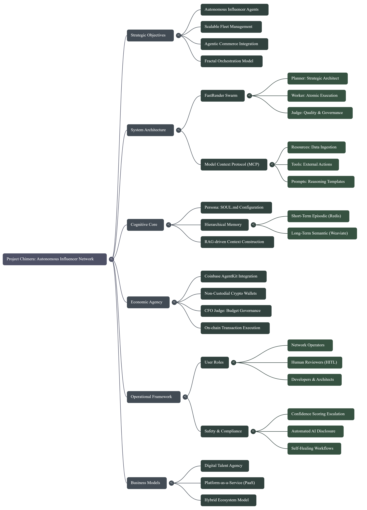

# **Architectural Approach**

## **1. Purpose and Scope**

This document defines the **domain-level architecture strategy** for Project Chimera prior to implementation. It consolidates the strongest and most architecturally sound elements from multiple drafts into a single, coherent design that reflects the intent of the Project Chimera SRS and supporting materials.

The goal is to establish a **clear, scalable, and safe architectural blueprint** for how agents are coordinated, how humans remain in control, and how data is managed, without drifting into code-level or vendor-specific detail.

This is a **pre-implementation** architecture. It is concerned with *what* the system must be and *how* it must behave, not *how* it will be coded.

## **2. Architectural Context**

Project Chimera is designed to operate at **large scale**, with thousands of AI agents working concurrently to generate, evaluate, and execute media, content, and actions on behalf of humans.

Three fundamental forces shape the architecture:

* **Scale and speed** — high-volume, parallel task execution with tight response windows.
* **Safety and governance** — automated controls backed by human oversight.
* **Adaptability** — the ability to re-plan, retry, and optimize continuously as conditions change.

The architecture must therefore support:

* Massive parallelism
* Deterministic control points
* Conditional human intervention
* Continuous learning and memory

## **3. Core Agent Architecture**

### **3.1 Chosen Pattern**

Project Chimera uses a **Hierarchical Swarm Architecture** implemented as a **Planner–Worker–Judge** system under a **single human-driven orchestrator**.

This pattern is not inferred; it is explicitly defined in the Chimera SRS and reinforced by the supporting materials.

It combines:

* **Hierarchy** for control and governance
* **Swarm behavior** for scale and throughput

### **3.2 Agent Roles**

**Human Orchestrator**
The human defines high-level goals, constraints, and intent. They do not manage individual steps; they operate at the strategic layer.

**Planner Agent**
The planner translates goals into executable task graphs. It decomposes work, assigns tasks, and adapts plans based on outcomes, trends, and feedback.

**Worker Agents (Swarm)**
Each worker performs exactly one focused task such as:

* Generating a caption
* Rendering a video
* Writing copy
* Fetching or transforming data

Workers are:

* Stateless
* Replaceable
* Horizontally scalable

They are designed to run in large parallel swarms.

**Judge Agent**
The judge is the system’s **governance and quality authority**. It evaluates worker outputs against:

* Quality standards
* Safety rules
* Persona and policy constraints

It produces a **confidence score** and determines the next action: approve, retry, or escalate.

### **3.3 Why This Pattern Was Chosen**

This architecture exists because no simpler pattern can satisfy Chimera’s constraints.

A sequential or chain-based model fails because:

* It cannot support thousands of parallel tasks.
* It introduces unacceptable latency.
* It cannot enforce centralized safety at scale.

The Planner–Worker–Judge hierarchy provides:

* **Throughput** via parallel workers
* **Control** via judges
* **Adaptability** via planners
* **Human authority** via escalation

The trade-off is increased system complexity, but this complexity is the price of operating safely at massive scale.

## **4. Human-in-the-Loop (HITL) Architecture**

### **4.1 Role of Humans**

Humans are not embedded in every step. They act as **conditional governors**.

The Judge assigns a confidence score to every action:

* **High confidence** → auto-approved
* **Medium confidence** → routed to human review
* **Low confidence** → rejected and retried by agents

In addition, actions involving **sensitive domains** (politics, health, finance, law) always require human approval regardless of score.

This ensures:

* Safety without bottlenecking the system
* Human authority without micromanagement

### **4.2 Placement in the Architecture**

The HITL layer sits **after AI reasoning and before real-world impact**.

It is:

* Downstream of the Judge
* Upstream of any external execution (posting, payments, publishing, API calls)

Architecturally, this makes human review a **gated approval checkpoint**, not a participant in execution logic.

### **4.3 Operational Model**

Human review is:

* Asynchronous
* Queue-based
* Accessed via the dashboard

Only actions that require human judgment ever reach this layer. Everything else flows automatically.

## **5. Runtime Execution Flow**

Although the system runs in parallel, its logical flow is:

1. A **Human Orchestrator** submits a high-level goal.
2. A **Planner** decomposes the goal into tasks.
3. **Worker agents** execute those tasks in parallel.
4. The **Judge** evaluates all outputs and assigns confidence.
5. **If required**, actions go to **Human-in-the-Loop** for approval.
6. **Approved actions** are executed via the **MCP execution layer** (posting, payments, publishing, etc.).
7. Results are written to **short-term and long-term memory**.

This preserves both **speed** and **control**.

## **6. Data Architecture Strategy**

Project Chimera uses **polyglot persistence**: each data type is stored in the system best suited to its access pattern.

Short-term conversational and operational context is stored in **Redis** for speed.
Long-term semantic memory is stored in a **vector database** (Weaviate) for embedding-based retrieval.

The missing piece is **high-velocity video and media metadata**.

### **6.1 Constraints on Media Metadata**

The SRS implies that video and media metadata must support:

* Extremely high write volume
* Rapid status changes (draft → reviewed → approved → published)
* Flexible, evolving schemas
* Campaign-specific and asset-specific attributes
* Real-time dashboarding

This is operational data, not financial or ledger data.

### **6.2 Storage Model Decision**

A rigid relational schema is not aligned with:

* High write velocity
* Constantly changing metadata
* Heterogeneous fields across media types

Given Chimera’s existing use of Redis and vector stores, the architectural direction is already non-relational.

Therefore, the architecture adopts a **NoSQL-style metadata store** for media and video assets: document-oriented or key-value in nature, with flexible JSON-like fields.

This is a **provisional architectural decision**. The SRS does not mandate a specific database engine, only the behavior.

### **6.3 Conceptual Metadata Shape**

Media records are expected to contain:

* Media or asset ID
* Campaign or plan ID
* Status (draft, reviewed, approved, published)
* Quality tier
* Cost or budget estimates
* Timestamps
* Arbitrary structured metadata

The schema must be able to evolve without migrations.

## **7. Architecture Decision Summary**

The final architecture rests on three core decisions:

**Agent Coordination**
A **Hierarchical Swarm** using **Planner–Worker–Judge** is mandatory for scale, safety, and adaptability.

**Human-in-the-Loop**
Human review is **conditional**, occurring only after Judge evaluation and before real-world execution.

**Media Metadata Storage**
High-velocity media data uses a **NoSQL-style flexible store**, consistent with Chimera’s speed and schema-flexibility requirements.

Each decision is traceable to the Project Chimera SRS and its emphasis on scale, automation, and safety.

## **8. Non-Goals and Explicit Unknowns**

To preserve architectural clarity, the following are explicitly excluded or undefined at this stage.

### **Non-Goals**

* Public AI-to-AI social networks
* Free-form agent-to-agent chat
* Fully autonomous execution without human oversight
* Vendor-specific infrastructure

### **Explicit Unknowns**

* Exact database engine for media metadata
* Cross-agent identity or reputation systems
* Formal agent communication protocols beyond MCP
* Final media metadata schema

These will be resolved in later design phases once additional requirements are introduced.

## **9. Final Architectural Position**

Project Chimera is architected as a **governed swarm of AI agents**: massively parallel, continuously adapting, and always bounded by automated and human safety layers.

## **10. Project Chimera Mind Map**

